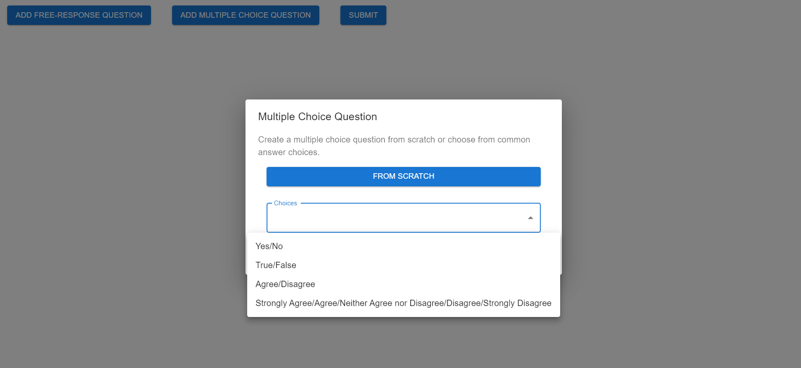
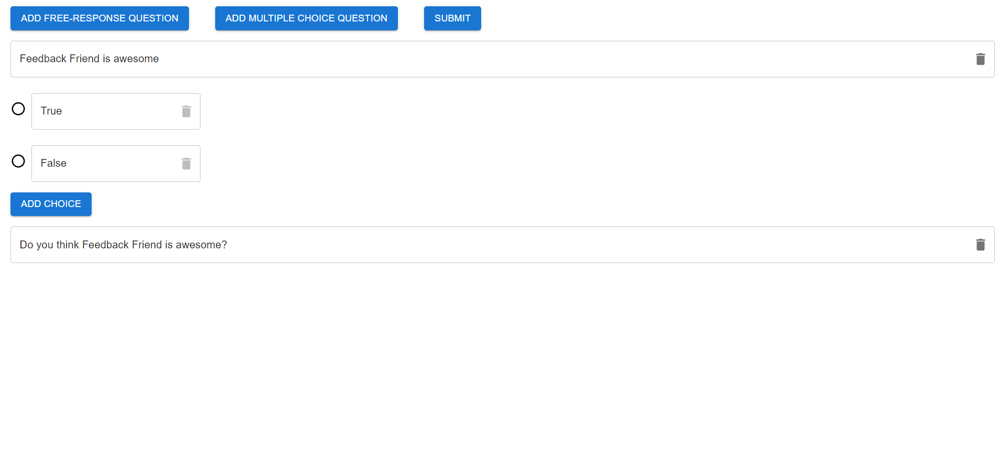
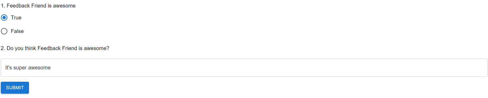
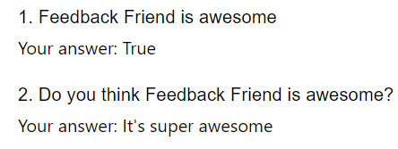

# Feedback Friend Prototype
A prototype for creating a survey, taking it, and viewing its results as part of the ongoing Feedback Friend project.

# How It Works
When the user first starts the app, they see the survey creation screen, where they can create free-response questions (FRQs) and multiple choice questions (MCQs), or submit the survey. Clicking the 'Add FRQ' button creates a text field that can be edited or deleted. Clicking the 'Add MCQ' opens a Dialog box that allows the user to create a question from scratch or choose from common MCQ answer choices. Once they create an MCQ, they can edit the question and its answer choices, delete the question, add additional answer choices, or delete answer choices (there must be at least 2 answer choices, and these cannot be deleted). After submitting the survey, the user goes to the 'Take Survey' page, where text fields and radio groups correspond to the FRQs and MCQs they have just created. After submitting this, they are taken to a screen showing the answers they have just given for each question.

# What It Looks Like
Options for creating a multiple choice question

Survey creation page with FRQ and MCQ

Taking the survey

Survey results

